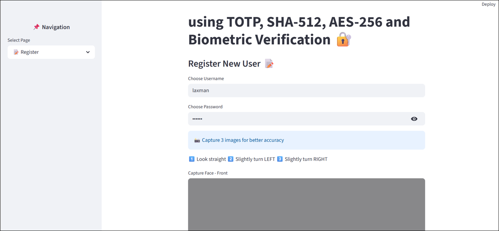
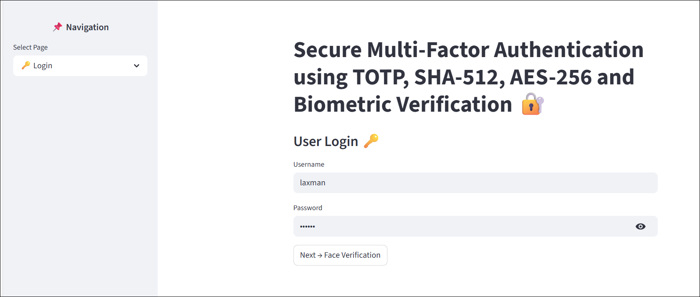
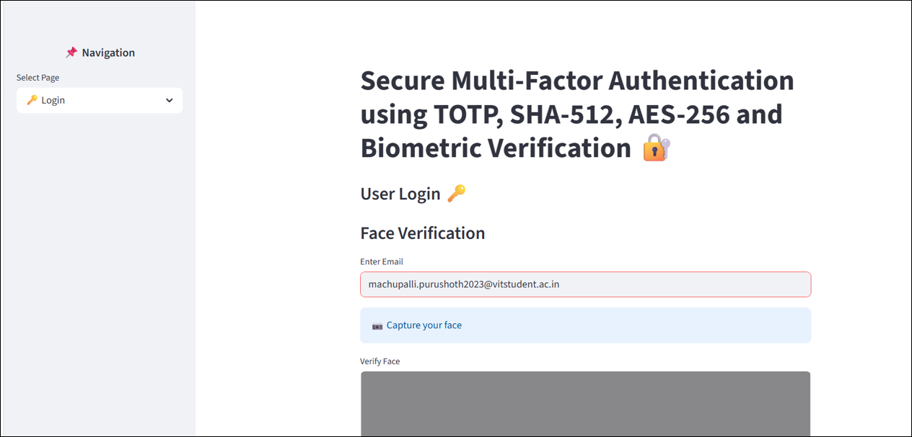
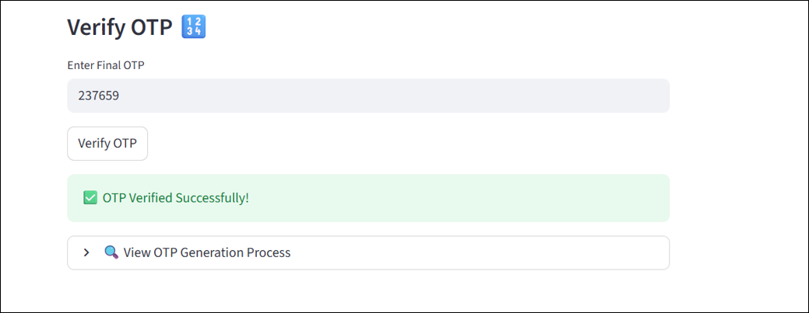
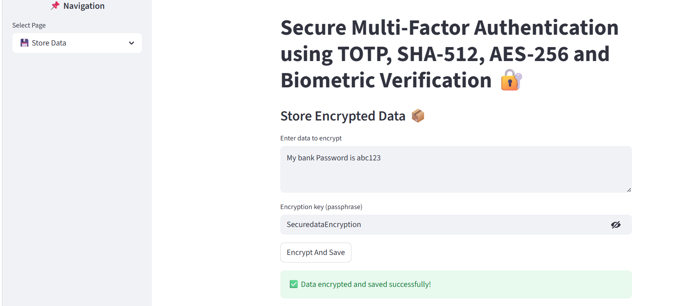
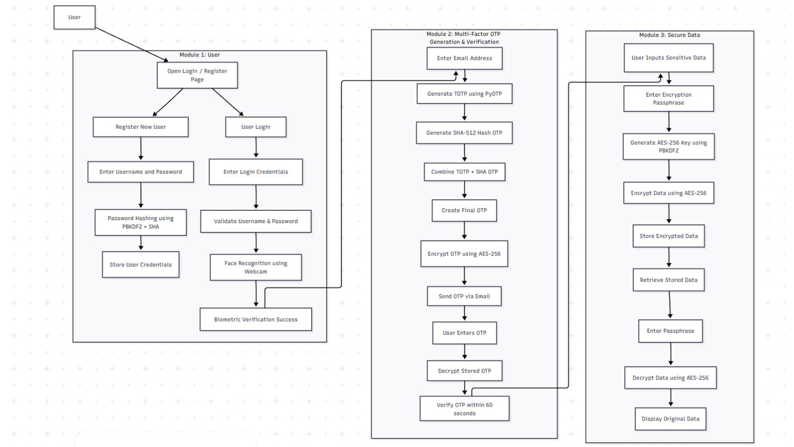

# 🔐 CipherAuth

Secure Multi-Factor Authentication System using TOTP, AES-256, SHA-512, and Biometric Verification.

---

# 📑 Table of Contents

1. [📌 Overview](#-overview)
2. [✨ Features](#-features)
3. [📸 Screenshots](#-screenshots)
4. [🏗️ System Architecture](#️-system-architecture)
5. [🛠️ Tech Stack](#️-tech-stack)
6. [📂 Project Structure](#-project-structure)
7. [⚙️ Installation & Setup](#️-installation--setup)
8. [🔐 Security Mechanisms](#-security-mechanisms)
9. [🚀 Future Improvements](#-future-improvements)
10. [👨‍💻 Author](#author)


---

# 📌 Overview

CipherAuth is a cybersecurity-focused authentication system designed to provide secure user verification using multiple security layers including password authentication, encrypted OTP validation, biometric face verification, and secure local data storage.

The system integrates cryptographic techniques and biometric authentication to enhance security against unauthorized access and credential compromise.

---

# ✨ Features

- 🔐 Multi-Factor Authentication (MFA)
- 🧠 Face Recognition Verification
- 🔑 TOTP-Based OTP Generation
- 🛡️ SHA-512 Password Hashing
- 🔒 AES-256 Encryption & Decryption
- 📧 Email OTP Verification
- 🚫 Login Attempt Lockout Protection
- 💾 Secure Local Data Storage
- 📊 Interactive Streamlit Interface

---

# 📸 Screenshots

## 📝 User Registration

<p align="center">
  
</p>

---

## ✅ Registration Successful

<p align="center">
  
</p>

---

## 🔑 User Login Interface

<p align="center">
  
</p>

---

## 📧 Email Entry for OTP Verification

<p align="center">
  
</p>

---

## 🧠 Face Verification & OTP Sending

<p align="center">
  
</p>

---

## 🔐 OTP Verification

<p align="center">
  
</p>

---

## 🔒 Secure Data Encryption

<p align="center">
  
</p>

---

# 🏗️ System Architecture

<p align="center">
  
</p>

---

# 🛠️ Tech Stack

- Python
- Streamlit
- OpenCV
- Face Recognition
- Cryptography
- PyOTP
- AES-256 Encryption
- SHA-512 Hashing

---

# 📂 Project Structure

```bash
CipherAuth/
│── images/
│── project.py
│── requirements.txt
│── README.md
│── .gitignore
```

---

# ⚙️ Installation & Setup

## Clone Repository

```bash
git clone https://github.com/PurushothamaReddyM/CipherAuth.git
cd CipherAuth
```

## Create Virtual Environment

```bash
python -m venv .venv
```

## Activate Environment

### Windows

```bash
.\.venv\Scripts\Activate.ps1
```

### Linux/Mac

```bash
source .venv/bin/activate
```

## Install Dependencies

```bash
pip install -r requirements.txt
```

## Run Application

```bash
streamlit run project.py
```

---

# 🔐 Security Mechanisms

- Passwords are securely hashed using SHA-512
- OTPs are generated using Time-Based One-Time Passwords (TOTP)
- Sensitive information is encrypted using AES-256 encryption
- Biometric face verification adds an additional authentication layer
- Login lockout protection helps prevent brute-force attacks

---

# 🚀 Future Improvements

- Cloud Database Integration
- JWT Session Management
- OAuth Authentication Support
- Real-Time Intrusion Detection
- Facial Anti-Spoofing Protection
- Advanced User Activity Monitoring

---

# Author

## M Purushothama Reddy

<p align="left">

<a href="mailto:machupalli.purushoth2023@vitstudent.ac.in" target="blank">

</a>

<a href="https://github.com/PurushothamaReddyM" target="blank">

</a>

</p>

---
